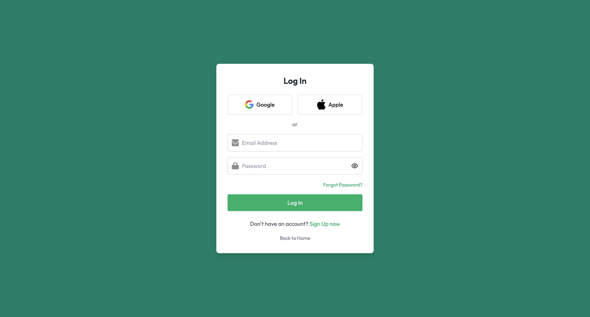
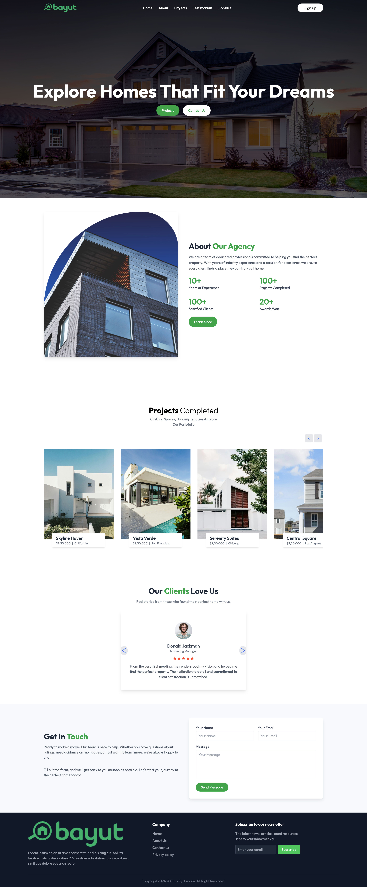

# Bayut Real State

Bayut Real State is a modern, responsive web application built to showcase real estate properties in a user-friendly interface. The project features an intuitive login system and a dynamic home page where users can browse available properties. Designed with a clean, modern UI and fully responsive layout, it demonstrates advanced frontend development skills.

## Live Demo

Check out the live demo here:  
[https://bayutcodebyhossam.netlify.app/](https://bayutcodebyhossam.netlify.app/)

## Screenshots

### Login Page

### Home Page

## Features

- **User Authentication:** Secure login functionality to ensure users can access their personalized experience.
- **Property Listings:** Dynamic display of real estate properties with modern UI elements.
- **Responsive Design:** The application is fully responsive, providing a seamless experience on mobile, tablet, and desktop devices.
- **Modern UI:** Clean and intuitive design with attention to usability and performance.

## Technologies Used

- **Frontend:**  
  - React  
  - Tailwind CSS  
  - Vite  
  - React Router
